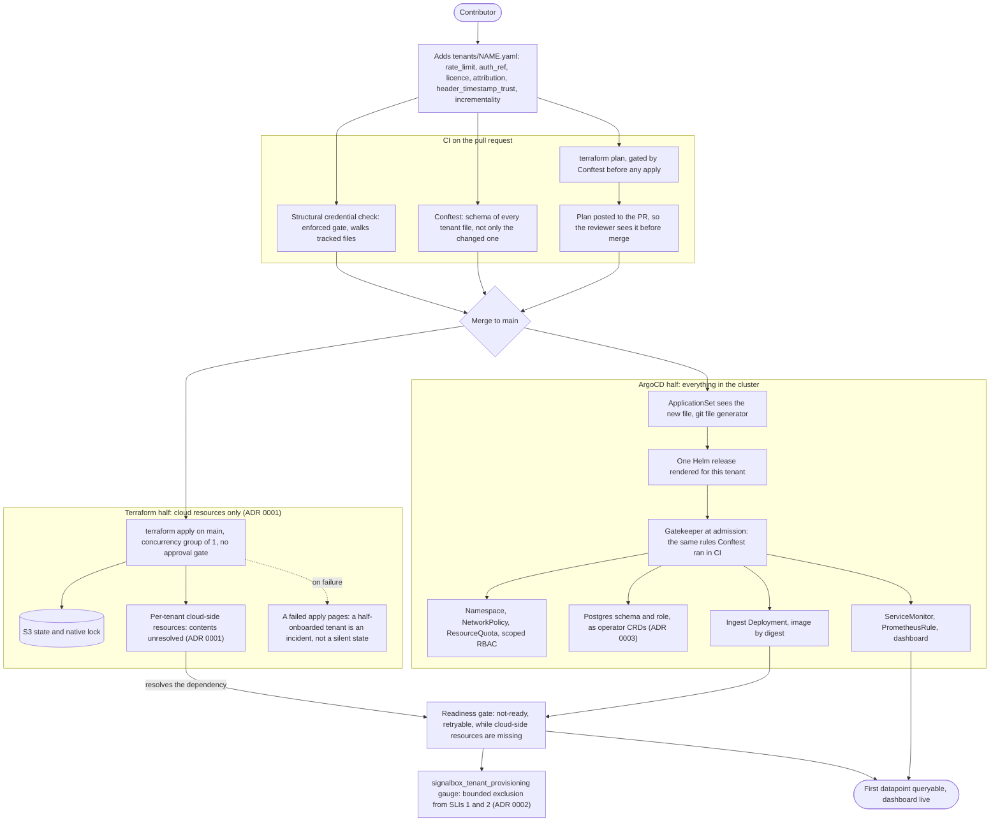
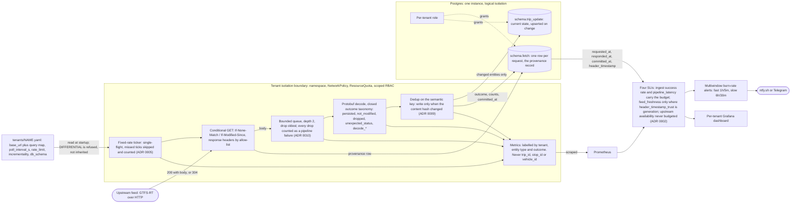

# Architecture

**These diagrams depict the END STATE described in [`PLAN.md`](PLAN.md), not what is built today.**
What exists right now is stated in prose under each diagram, from [`status.md`](status.md), and is
deliberately not colour-coded inside the diagrams — the shapes stay readable and the status text
stays cheap to update.

Every node traces to `PLAN.md`, an ADR under [`decisions/`](decisions/), or code in this repo.
Where `PLAN.md` is silent on something structural, nothing is drawn and the gap is listed under
[What PLAN.md leaves underspecified](#what-planmd-leaves-underspecified) at the end.

**Scope note, before the diagrams.** [`limits.md`](limits.md) says of itself that it is not yet
complete — it carries the limits found while building the review machinery, and `PLAN.md` section 9
remains authoritative for the platform. So the two do not disagree about platform scope. They do
disagree about one component's coverage, and `limits.md` wins: `PLAN.md` section 6.5 says the
structural credential check covers *"every committed file"*, while `limits.md` records that it walks
**tracked** files (`git ls-files`), so an untracked credential in the working tree is invisible to
it. Diagram 2 labels that gate at the size `limits.md` gives it. This is flagged rather than
silently reconciled.

---

## 1. System context

The whole target platform: the control plane, one ingest pipeline per tenant, storage, quotas,
dashboards and alerts, the upstream feeds as external actors, and the two cloud boundaries.

```mermaid
flowchart LR
  contributor(["Contributor"])
  operator(["Operator laptop: Ansible, bootstrap only"])
  upstream_feeds(["Upstream public transit feeds: VBB (DE), opentransportdata.swiss (CH), OVapi (NL), HSL (FI)"])
  alert_sink(["Alert delivery: ntfy.sh or Telegram"])
  private_access(["Tailscale or Cloudflare Tunnel: no public ingress"])

  subgraph github["GitHub"]
    git_repo["Git repo: tenants/, charts/, clusters/, policy/, infra/"]
    ci["GitHub Actions: Conftest, credential gate, multi-arch build, terraform plan and apply"]
    ghcr["GHCR: multi-arch image, referenced by digest"]
  end

  subgraph aws["AWS eu-central-1: Terraform state only"]
    tf_state[("S3 bucket signalbox-tfstate: versioned, native S3 locking")]
  end

  subgraph oci["OCI Always Free, Frankfurt: the running floor"]
    cloud_floor["Cloud floor, Terraform-owned: VCN, public subnet, internet gateway, route table, NSG"]
    data_vol[("Block volume, 50 GB, attached: Postgres data")]
    tenant_cloud["Per-tenant cloud-side resources: Stage 2 module, contents unresolved (ADR 0001)"]

    subgraph oci_node["One A1.Flex instance: 2 OCPU / 12 GB, arm64, k3s"]
      argocd["ArgoCD, self-managed by app-of-apps"]
      appset["ApplicationSet: git file generator over tenants/"]
      gatekeeper["Gatekeeper: policy at admission"]
      tenant_ns["Per-tenant namespace: ingest Deployment, NetworkPolicy, ResourceQuota, scoped RBAC"]
      pg_operator["Postgres operator, declarative CRDs (ADR 0003)"]
      postgres[("Postgres: one instance, schema and role per tenant")]
      prometheus["Prometheus: ServiceMonitor, PrometheusRule, burn-rate rules"]
      grafana["Grafana: per-tenant dashboards"]
    end
  end

  contributor -->|"pull request"| git_repo
  git_repo --> ci
  ci -->|"state and lock"| tf_state
  ci -->|"terraform apply: cloud resources only"| cloud_floor
  ci -->|"terraform apply: per tenant"| tenant_cloud
  ci -->|"terraform apply"| data_vol
  ci -->|"push multi-arch image"| ghcr
  ci -->|"write image digest into values"| git_repo

  operator -->|"Ansible, once at bootstrap: k3s, ArgoCD, age key Secret"| argocd
  operator -->|"SSH 22, operator CIDR only"| cloud_floor

  git_repo -->|"desired state"| argocd
  argocd --> appset
  argocd --> gatekeeper
  argocd --> pg_operator
  argocd --> prometheus
  argocd --> grafana
  appset -->|"one Helm release per tenant"| tenant_ns
  gatekeeper -.->|"admits or rejects"| tenant_ns
  pg_operator -->|"databases, roles, schemas as CRDs"| postgres
  ghcr -->|"image pulled by digest"| tenant_ns

  tenant_ns -->|"conditional GET, one pipeline per tenant"| cloud_floor
  cloud_floor -->|"open egress via the internet gateway"| upstream_feeds
  tenant_ns -->|"rows into its own schema"| postgres
  postgres --> data_vol
  tenant_ns -->|"scraped metrics"| prometheus
  prometheus --> grafana
  prometheus -->|"multiwindow burn-rate alerts"| alert_sink
  grafana --> private_access
  argocd --> private_access
  private_access --> operator
```

**How to read it.**

- **The two clouds are separate boundaries on purpose.** AWS holds Terraform state and nothing else;
  the state bucket is split out into its own configuration because it must exist before anything
  that stores state in it (`infra/terraform/bootstrap/`, [ADR 0007](decisions/0007-terraform-state-backend.md)).
  OCI holds the entire running floor ([ADR 0008](decisions/0008-oci-cloud-floor.md)).
- **The ownership boundary is the diagram's main claim.** Terraform's arrows stop at cloud
  resources; every arrow into the cluster comes from ArgoCD (`PLAN.md` section 3). Nothing draws two
  writers onto one object, because two reconcilers over one object produce a silent flapping loop
  rather than an error.
- **Ansible's arrow is the one carve-out**, and it is three steps, not one: k3s install, ArgoCD
  install, and delivery of the age private key as a Secret (`PLAN.md` section 3, `limits.md`). After
  that Ansible never touches the cluster.
- **Postgres objects are drawn under ArgoCD, through an operator**, because schemas and roles live
  in neither the OCI API nor the Kubernetes API and would otherwise have no owner
  ([ADR 0003](decisions/0003-postgres-object-ownership.md)). CloudNativePG is the candidate to
  evaluate first; whether its CRDs reach schema granularity is an open verification item, so the
  node is named for the pattern rather than the product.
- **No load balancer and no public ingress node exists.** Grafana and ArgoCD sit behind Tailscale or
  a Cloudflare Tunnel (`PLAN.md` section 10); the choice between the two is not made, so both are on
  one node rather than one being picked.
- **gtfs.de is absent from the upstream actors deliberately.** It is characterised and excluded as a
  tenant on measured resource grounds — roughly 40 MB per fetch against a measured ~29s cadence
  (`PLAN.md` section 9, `metrics.md`).
- The node is one instance because 2 OCPU / 12 GB *is* the whole Always Free allowance, by
  arithmetic rather than preference (ADR 0008 decision 3). The block volume is separate from boot so
  Gate 9 is a rebuild drill and not a data-loss event.

**Status.**

- **Exists today.** The AWS state bucket, versioned with public access blocked, created by
  `infra/terraform/bootstrap/` and used as the backend by `infra/terraform/platform/` — Gate 1,
  passed 2026-08-29. The GitHub repo and three CI workflows (`secrets-check`, `terraform-check`,
  `ingest-check`). One tenant file, `tenants/hsl_tripupdates.yaml`. An ingest service under
  `services/ingest/` that has run for one hour against the live HSL feed — Gate 5, passed
  2026-08-30 — but against a local Postgres in Docker, not the one drawn here.
- **Written, not provisioned.** The OCI cloud floor (`infra/terraform/platform/`: VCN, subnet,
  gateway, route table, NSG, A1.Flex instance, block volume). `fmt`, `init` and `validate` pass in
  CI; `apply` has never run. **Gate 2 is blocked on an OCI tenancy that does not exist** — signup
  rejected 2026-08-29, cause unknown, decision on OCI versus the Hetzner CX32 fallback due
  2026-09-05.
- **Planned, nothing built.** Everything inside the node subgraph: k3s, ArgoCD, the ApplicationSet,
  Gatekeeper, the Postgres operator, in-cluster Postgres, Prometheus, Grafana. Also GHCR and the
  image, the Ansible tree (`infra/ansible/` does not exist), the per-tenant cloud module, the
  private-access path, alert delivery, and the `charts/`, `clusters/` and `policy/` directories.
  Gates 3, 4, 6, 7, 8 and 9 are not started.

---

## 2. Tenant onboarding: the one merged pull request

The project's central claim, end to end. One file lands in `tenants/`; two consumers act on it, and
the ordering between them is designed rather than raced.

**How to read it.**

- **`tenants/NAME.yaml` is one file with two consumers and no ordering relationship between them**
  (`PLAN.md` section 3). ArgoCD acts the moment the file lands in git; Terraform has no equivalent
  trigger. [ADR 0001](decisions/0001-terraform-apply-path.md) supplies one — CI applies on merge to
  `main`, with a concurrency group of 1 so applies serialise on the S3 lock rather than fight over
  it, and **no environment approval gate**, because an approval step would reintroduce exactly the
  manual action the onboarding claim removes.
- **The race is closed at the consumer, not by coupling the two systems.** The ingest service treats
  a missing cloud-side dependency as a retryable not-ready condition rather than crashlooping (ADR
  0001), and the resulting provisioning window is excluded from the error budget mechanically and
  with a deadline, so a tenant that never finishes provisioning still burns budget
  ([ADR 0002](decisions/0002-sli-split.md)).
- **Conftest validates every tenant file, not just the changed one.** A malformed file breaks one
  tenant; a file that breaks the ApplicationSet *template* breaks every tenant at once
  (`PLAN.md` section 10).
- **The same rules run twice on purpose.** Conftest in CI is fast feedback; Gatekeeper at admission
  is enforcement, because anyone with kubectl bypasses CI (`PLAN.md` section 9).
- **The credential gate is drawn at its real size.** It walks tracked files, so it sees a credential
  first at the commit that adds it — `limits.md`, which narrows `PLAN.md` section 6.5's "every
  committed file".
- The plan-to-PR arrow exists so review happens where the plan output is, which is what replaces the
  approval gate (ADR 0001).

**Status.**

- **Exists today.** `tenants/hsl_tripupdates.yaml` and its loader
  ([`config.py`](../services/ingest/ingest/config.py)), which validates all six first-class fields
  and refuses a `base_url` carrying a query string. The structural credential check
  ([`check_no_secrets.py`](../scripts/probe/check_no_secrets.py)) with its adversarial suite,
  enforced in CI by `secrets-check.yml`. Terraform static checks in CI (`terraform-check.yml`),
  which deliberately do **not** initialise the real S3 backend — no AWS credentials are in this
  repo's Actions.
- **Planned, nothing built.** Every other box: Conftest and its Rego, the terraform-plan-on-PR and
  apply-on-main workflows, the pager on a failed apply, the ApplicationSet, the Helm chart,
  Gatekeeper, the operator-managed schema and role, the observability objects, the readiness gate
  and the provisioning gauge. `policy/`, `charts/` and `clusters/` do not exist. This whole path is
  Stage 2 and Stage 3 work; today the one tenant file has exactly one consumer, the ingest service,
  and there is no cluster.
- **Not yet decided, and therefore not drawn as such:** whether CI reaches OCI by OIDC federation or
  by a scoped long-lived API key. ADR 0001 flags OIDC as verify-don't-assume and records the
  fallback as the weaker position.

---

## 3. Single-tenant data path

One feed, from upstream poll to stored and observable, with the isolation boundary drawn around it.
This is the shape the ApplicationSet renders once per tenant.

**How to read it.**

- **The isolation boundary is the namespace and its NetworkPolicy, ResourceQuota and scoped RBAC**,
  rendered per tenant by the ApplicationSet (`PLAN.md` section 3 and section 11). It is drawn around
  the pipeline and *not* around the database, because Postgres isolation is weaker and deliberately
  so: one instance, schema per tenant, per-tenant roles (`PLAN.md` section 9). Drawing one boundary
  around both would overstate the system.
- **Scheduling is fixed-rate, not sleep-after-completion.** Under sleep-after-completion the
  sampling interval is a distribution shaped by the thing being sampled, and every claim computed
  from it inherits that ([ADR 0005](decisions/0005-ingest-scheduling.md)). A tick arriving while a
  fetch is in flight is skipped and counted, never queued (a burst) and never overlapped (which
  would break the single-flight property that bounds our request rate).
- **Drop-oldest is gated on `incrementality`.** It is safe only because each snapshot fully
  supersedes its predecessor; a `DIFFERENTIAL` feed makes it wrong, so the service refuses to start
  rather than inherit a policy chosen for a different feed shape
  ([ADR 0010](decisions/0010-ingest-backpressure.md), enforced in `config.py`).
- **Drops are failures.** If a dropped snapshot were invisible, the fastest route to a green success
  rate at Gate 8 would be a more aggressive drop policy — the SLO would reward the behaviour it
  exists to detect (ADR 0010). The same argument is why every non-200/304 status collapses to one
  closed `unexpected_status` outcome rather than a per-status string that falls outside the taxonomy.
- **`fetch` feeds the SLIs directly.** Both endpoints of `pipeline_latency` — fetch completion and
  row committed — are columns in that table, which is why it exists at Gate 5 rather than being
  retrofitted at Gate 8 ([ADR 0009](decisions/0009-ingest-storage-model.md)).
- **The service never creates its own schema** (ADR 0009 decision 4); it fails loudly against a
  missing one. A service that converges its own schema on every boot is a second reconciler over
  objects ADR 0003 assigns to ArgoCD.
- The cardinality rule is on the exporter node because it is a hard rule, not a guideline:
  Prometheus on 12 GB dies quickly otherwise (`PLAN.md` section 7).

**Status.**

- **Exists today, and has run.** The ticker, poller, bounded queue, decoder, dedup and both tables —
  `services/ingest/ingest/{poller,dropqueue,decode,store,run}.py` and
  `services/ingest/sql/001_schema.sql`. Verified by one hour against the live HSL feed on
  2026-08-30: 719 requests, 99.9% coverage, evidence under [`runs/gate5/`](../runs/gate5/).
- **Exists, but not where it is drawn.** Postgres is a local Docker dependency at Gate 5, not an
  in-cluster instance under an operator, and the schema is applied by an explicit
  `python -m ingest.migrate` command rather than by CRDs. ADR 0009 makes that a swap for Stage 2,
  not a conflict.
- **Planned, nothing built.** The isolation boundary itself (no cluster, no namespace, no
  NetworkPolicy, no ResourceQuota), the metrics exporter, Prometheus, the four SLIs, burn-rate
  alerting, the dashboard and alert delivery. Gate 5 deliberately imports no metrics library:
  observability is Gate 7's decision and importing one now would pre-empt it. The per-tenant DB role
  does not exist either — Gate 5 runs as one role against one schema.
- **Known prerequisite carried into Stage 2.** Postgres role DDL spells a credential as
  `PASSWORD 'value'`, which has no delimiter the credential gate's `key=value` rule anchors on. It
  is pinned as a failing-as-designed test today (`status.md`).

---

## What PLAN.md leaves underspecified

Places where the topology could not be drawn from `PLAN.md`, an ADR or the code. Nothing below was
filled in with a plausible default.

1. **Traces have no destination.** Gate 7 names an OpenTelemetry SDK for traces and says a collector
   would need to justify itself — but no collector, backend or trace store is named anywhere. No
   trace path is drawn at all. This is the largest structural hole; the metrics half of Gate 7 is
   fully specified and the trace half stops at the SDK.
2. **The per-tenant cloud-side resources are explicitly unresolved.** ADR 0001 leaves the question
   open and speculates "perhaps an object storage bucket and an IAM policy" inside OCI's 20 GB /
   50,000-request cap; `PLAN.md` section 11 repeats that the module may turn out thin. Drawn as one
   node whose contents are named as unresolved, because inventing a bucket to make the boundary look
   better defended is exactly what ADR 0001 forbids.
3. **How ArgoCD decrypts SOPS is undecided.** `PLAN.md` section 10 lists ksops, helm-secrets or a
   config management plugin and says decide it in Stage 1 — it changes chart structure, so it is
   structural. Only the age key Secret, which Ansible delivers, is drawn. Related and equally open:
   the path from a tenant's `auth_ref` to a credential in the running pod's environment.
4. **Nothing routes alerts.** `PLAN.md` Gate 8 specifies multiwindow burn-rate alerts and names the
   destination (ntfy.sh or Telegram) but names no Alertmanager or equivalent router. Drawn as a
   direct edge from the alerting rules to the sink; if a router is intended, it is a missing node.
5. **ServiceMonitor and PrometheusRule are named without the controller that provides them.**
   `PLAN.md` section 3 lists both as ArgoCD-owned objects; those CRDs come from a Prometheus operator
   that appears nowhere in the plan. Prometheus is drawn as one node and no operator was invented.
6. **The provisioning audit log has no location.** Stage 3 requires an "append-only audit log of
   every provisioning action" with no statement of what writes it, where it is stored, or how it is
   made append-only. Not drawn.
7. **Two live disjunctions are drawn as disjunctions**, since the plan itself offers both and picks
   neither: Tailscale versus Cloudflare Tunnel for private access, and ntfy.sh versus Telegram for
   alert delivery. These are noted rather than resolved.
8. **The Postgres operator is a pattern, not yet a product.** ADR 0003 says evaluate CloudNativePG
   first and carries an outstanding verification item — whether its CRDs reach schema granularity.
   If they do not, schema creation may still need a Job, which would change the ownership arrows in
   diagrams 1 and 2.
9. **Whether the state bucket is inside Gate 9's "destroy everything" is deliberately not
   pre-empted** (ADR 0007). The diagrams therefore draw AWS as a separate boundary and assert
   nothing about the rebuild scope crossing it.
10. **Not a gap, but a scope decision worth restating:** gtfs.de is excluded as a tenant on measured
    resource grounds, so it appears in no diagram despite being in `PLAN.md` section 4's original
    feed set.
